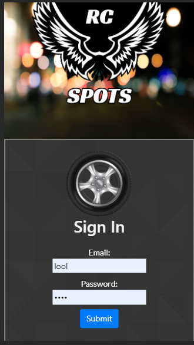

# RC spots 

  

  ##  Description
  
  RC spots is a social media platform for RC car enthusiasts. The purpose of this website is to give the RC community a place to share their favorite locations to drive.

  ## Table Of Contents

  * [Installation](#installation)
  * [Usage](#usage)
  * [Credits](#credits)
  * [License](#license)

  ## View live site: https://powerful-journey-56416.herokuapp.com/
  
  
  ## Installation

  npm i

  ## Usage

  RC cars is used as a platform to connect RC enthusiasts, while also creating a library of new RC spots for the community.

  ## Credits

  Matthew Marchand, Jason Mcdonald, Oscar Medina

  ## Test

    npm start

  ## License

  MIT

## Technologies Used

HTML, CSS, React, Node, Express, AnimeJS, Cloudinary, Javascript, MongoDB, Mongoose, Bootstrap, Bcrypt, Multer, Nodemon, Passport, Cors

## Questions

  for any questions or inquiries  please feel free to message me on Github at: https://github.com/marchandmr

  or you can send me an E-mail :  marchandmr@icloud.com

 

 
